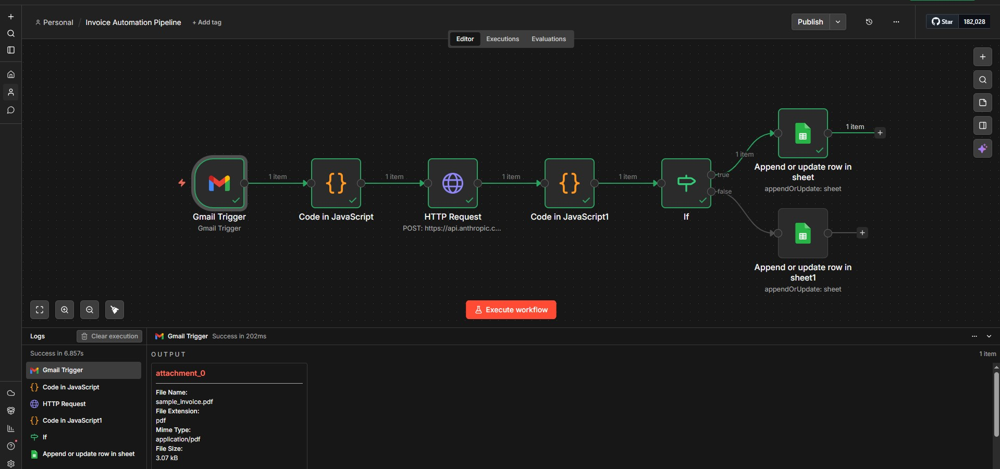
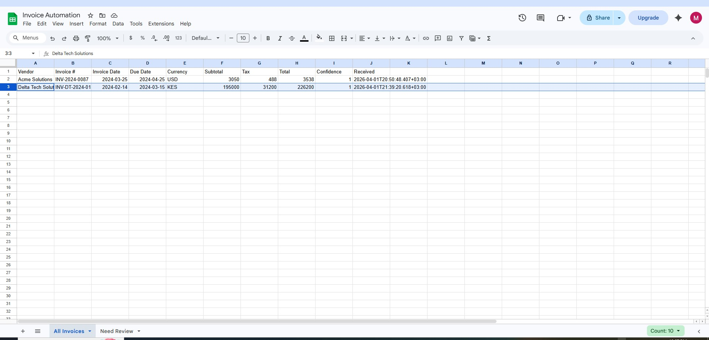
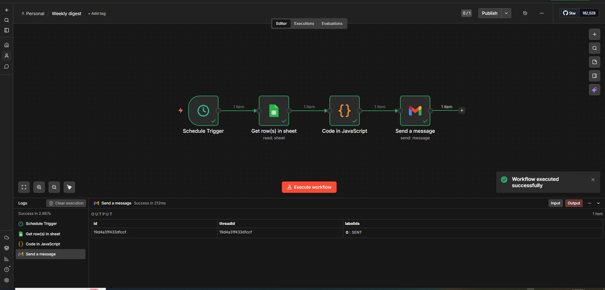
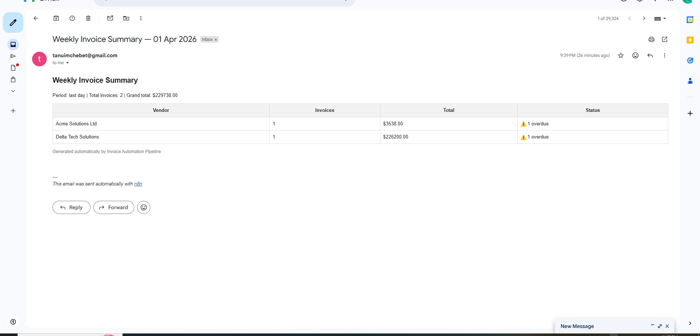

# Invoice Automation Pipeline

An AI-powered invoice processing pipeline built with n8n, Claude API, and Google Sheets.

## Problem
Businesses receiving 200+ invoices per month via email face hours of manual 
sorting, data entry, and tracking every week.

## Solution
A two-workflow automation system that processes invoices end to end with zero 
manual input.

---

## Workflow Files
| File | Description |
|---|---|
| `invoice-automation-pipeline.json` | Event-driven invoice processing workflow |
| `weekly-digest.json` | Scheduled weekly summary email workflow |

---

## How It Works

### Workflow 1 — Invoice Processing Pipeline (event-driven)
1. Gmail trigger detects incoming emails with PDF attachments
2. JavaScript Code node converts binary PDF to base64 format
3. Claude API (Anthropic) extracts structured data from the PDF
4. Confidence check routes clean extractions to All Invoices tab
5. Low-confidence extractions flagged to Needs Review tab in Google Sheets

### Workflow 2 — Weekly Digest (scheduled)
1. Runs every Sunday automatically
2. Reads last 7 days of invoice data from Google Sheets
3. Aggregates totals by vendor and flags overdue invoices
4. Sends formatted HTML summary email to business owner

---

## Stack
- **n8n** — workflow orchestration
- **Claude API (Anthropic)** — AI-powered PDF data extraction
- **Google Sheets** — data storage and vendor sorting
- **Gmail** — email trigger and digest delivery
- **JavaScript** — binary to base64 conversion, data aggregation

---

## Key Features
- Automatic vendor sorting in Google Sheets
- Confidence scoring on every extraction
- Human review flagging for uncertain extractions
- Deduplication by invoice number
- Weekly HTML digest with totals and overdue flags

---

## Extracted Fields
| Field | Description |
|---|---|
| vendor_name | Supplier name |
| invoice_number | Unique invoice ID |
| invoice_date | Date of issue |
| due_date | Payment due date |
| currency | Invoice currency |
| subtotal | Amount before tax |
| tax | Tax amount |
| total | Total amount due |
| confidence | AI extraction confidence score |
| review_reason | Reason for flagging if confidence < 0.85 |

---

## Screenshots

### Workflow 1 — Invoice Processing Pipeline

### Google Sheets Output

### Workflow 2 — Weekly Digest Pipeline

### Weekly Digest Email

---

## Built By
Milena Tanui — AI Agent Builder & Workflow Automation Specialist  
[Portfolio](https://milena-tanui.github.io/Portfolio/) · [LinkedIn](https://linkedin.com/in/milena-tanui-64b898173/)
